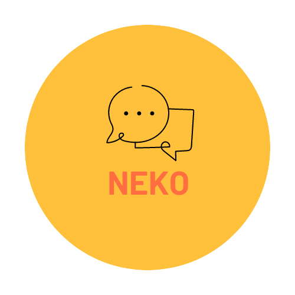

# Neko - Application Mobile de Chat

  

## Introduction
Bienvenue dans la documentation de l'API Neko ! Cette API accompagne l'application de chat mobile Neko développée avec React Native. Elle est conçue pour permettre aux utilisateurs de discuter en temps réel, de créer des groupes de discussion et d'envoyer des messages de manière fluide et sécurisée. Voici un aperçu des fonctionnalités principales de l'API :

## Fonctionnalités clés

1. **Authentification et gestion des utilisateurs:** Permet aux utilisateurs de s'inscrire, de se connecter et de gérer leur profil utilisateur.

2. **Chat en temps réel:** Prend en charge les conversations en temps réel entre utilisateurs, leur permettant d'envoyer et de recevoir des messages instantanément.

3. **Groupes de discussion:** Permet aux utilisateurs de créer des groupes de discussion pour des conversations de groupe.

4. **Envoi de messages:** Autorise l'envoi de messages textuels et multimédias dans les discussions individuelles et de groupe.

## Technologies utilisées

- **Node.js**: Plateforme JavaScript côté serveur utilisée pour exécuter l'API Neko.
- **Express.js**: Framework web minimaliste pour la création d'applications web et d'API robustes.
- **React Native**: Framework pour le développement d'applications mobiles multiplateformes, utilisé pour construire l'application de chat mobile Neko.
- **React.js**: Bibliothèque JavaScript utilisée pour développer le panneau d'administration de l'API.
- **MongoDB**: Base de données NoSQL utilisée pour stocker les informations des utilisateurs, les conversations et les messages.
- **Qasuar**: Un outil pour la construction rapide de tableaux de bord et de panneaux d'administration.

## Installation

Pour exécuter l'API Neko localement, suivez ces étapes :

1. Assurez-vous que vous avez **Node.js** installé sur votre machine.

2. Clonez le dépôt de l'API Neko depuis GitHub.

3. Accédez au répertoire du projet et exécutez la commande suivante pour installer les dépendances :

npm install

markdown
Copy code

4. Configurez votre base de données MongoDB avec les informations de connexion appropriées.

5. Lancez l'API en utilisant la commande :

npm start

markdown
Copy code

6. L'API Neko devrait être accessible à l'adresse `http://localhost:3000` par défaut.

## Endpoints

Voici les principaux endpoints exposés par l'API Neko :

- `POST /api/signup`: Permet à un nouvel utilisateur de s'inscrire en fournissant les informations nécessaires.

- `POST /api/login`: Permet à un utilisateur existant de se connecter à son compte.

- `GET /api/users/:id`: Récupère les informations d'un utilisateur spécifique à partir de son identifiant.

- `POST /api/chats`: Crée une nouvelle conversation entre deux utilisateurs.

- `GET /api/chats/:id`: Récupère les messages d'une conversation spécifique à partir de son identifiant.

- `POST /api/groups`: Crée un nouveau groupe de discussion.

- `GET /api/groups/:id`: Récupère les informations d'un groupe de discussion spécifique à partir de son identifiant.

- `POST /api/messages`: Envoie un nouveau message dans une conversation individuelle ou de groupe.

Ceci n'est qu'un bref aperçu des endpoints disponibles. Pour plus de détails sur l'utilisation de chaque endpoint, consultez la documentation complète de l'API.

## Documentation complète

Pour une documentation plus détaillée sur l'utilisation de l'API Neko, consultez le fichier [API_DOCUMENTATION.md](lien-vers-le-fichier).

## Contribution

Nous sommes ouverts aux contributions ! Si vous souhaitez améliorer l'API Neko, corriger des bogues ou ajouter de nouvelles fonctionnalités, n'hésitez pas à soumettre des pull requests.

## Remarque

Assurez-vous de bien configurer les autorisations et les mesures de sécurité appropriées pour l'API Neko, en particulier si vous prévoyez de la déployer dans un environnement de production.

Profitez de l'API Neko pour créer une expérience de chat mobile riche et agréable pour vos utilisateurs ! Si vous avez des questions ou des problèmes, n'hésitez pas à nous contacter.

Amusez-vous bien !

L'équipe Neko

